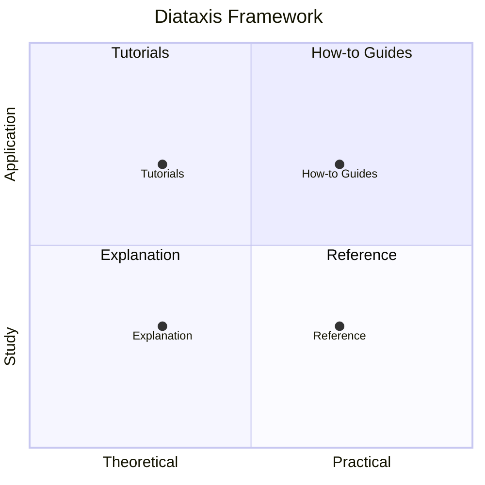

# Documentation Overview

This documentation is organized using the **[Diataxis framework](https://diataxis.fr/)**, a systematic approach to technical documentation that divides content into four categories based on user needs.

## 📁 Structure

```text
docs/
├── tutorials/          # Learning-oriented (practical)
├── how-to/            # Problem-oriented (practical)
├── reference/         # Information-oriented (theoretical)
└── explanation/       # Understanding-oriented (theoretical)
```

## 🎯 Finding What You Need

### I want to learn

→ Start with **[Tutorials](tutorials/)**

- [Getting Started](tutorials/getting-started.md) - Your first 10 minutes
- [Quickstart](tutorials/quickstart.md) - Quick reference for local development
- [Basic Template Rendering](tutorials/basic-template-rendering.md) - Core concepts
- [Argo Workflow Deployment](tutorials/argo-workflow-deployment.md) - Real-world example

### I need to accomplish a task

→ Check the **[How-to Guides](how-to/)**

- [Set Up Local Development](how-to/local-development.md)
- [Set Up Releases and CI/CD](how-to/setup-release.md)
- [Set Up Documentation Generation](how-to/setup-documentation-generation.md)
- [Release a Version](how-to/release-version.md)

### I need to look something up

→ See the **[Reference](reference/)**

- [Data Source: render_template](reference/data-source-render-template.md) - API reference
- [Placeholder Syntax](reference/placeholder-syntax.md) - Syntax specification
- [GitHub Actions Workflows](reference/github-actions-workflows.md) - Workflow specs

### I want to understand why

→ Read the **[Explanation](explanation/)**

- [Why This Provider?](explanation/why-this-provider.md) - Problem and solution
- [Design Requirements](explanation/design-requirements.md) - Original goals
- [Documentation System](explanation/documentation-system.md) - How docs work
- [Release Process](explanation/release-process.md) - How releases work

## 📊 Diataxis Quadrants



## 🚀 Quick Start Paths

### For New Users

1. [Getting Started Tutorial](tutorials/getting-started.md)
2. [Quickstart](tutorials/quickstart.md)
3. [Basic Template Rendering](tutorials/basic-template-rendering.md)

### For Contributors

1. [Local Development Setup](how-to/local-development.md)
2. [Setup Documentation Generation](how-to/setup-documentation-generation.md)
3. [Setup Release Process](how-to/setup-release.md)
4. [Release a Version](how-to/release-version.md)

### For Argo Workflows Users

1. [Argo Workflow Deployment Tutorial](tutorials/argo-workflow-deployment.md)
2. [Placeholder Syntax Reference](reference/placeholder-syntax.md)
3. [Why This Provider?](explanation/why-this-provider.md)

## 📚 Additional Resources

- **[Main README](../README.md)** - Project overview and quick examples
- **[Examples](../examples/)** - Working code examples
- **[CHANGELOG](../CHANGELOG.md)** - Version history
- **[GitHub Repository](https://github.com/spantree/terraform-provider-utils)**
- **[Terraform Registry](https://registry.terraform.io/providers/spantree/utils)**

## 🤝 Contributing to Documentation

Documentation contributions are welcome! When adding new documentation:

1. **Determine the category** using Diataxis principles:
   - **Tutorial**: Teaching a beginner through a lesson
   - **How-to**: Solving a specific problem
   - **Reference**: Describing the machinery
   - **Explanation**: Clarifying and illuminating

2. **Follow the existing structure** in each category

3. **Cross-reference** related documents

4. **Update this index** when adding new pages

## 📖 About Diataxis

The [Diataxis framework](https://diataxis.fr/) helps create documentation that serves different user needs:

- **Tutorials** are learning-oriented lessons that take the reader by the hand
- **How-to guides** are goal-oriented directions that guide the reader through a problem
- **Reference** is information-oriented technical description of the machinery
- **Explanation** is understanding-oriented discussion that clarifies and illuminates

This structure ensures users can quickly find the type of information they need, whether they're learning, problem-solving, looking up details, or seeking understanding.

---

**Need help?** Open an [issue](https://github.com/spantree/terraform-provider-utils/issues) or start a [discussion](https://github.com/spantree/terraform-provider-utils/discussions).
