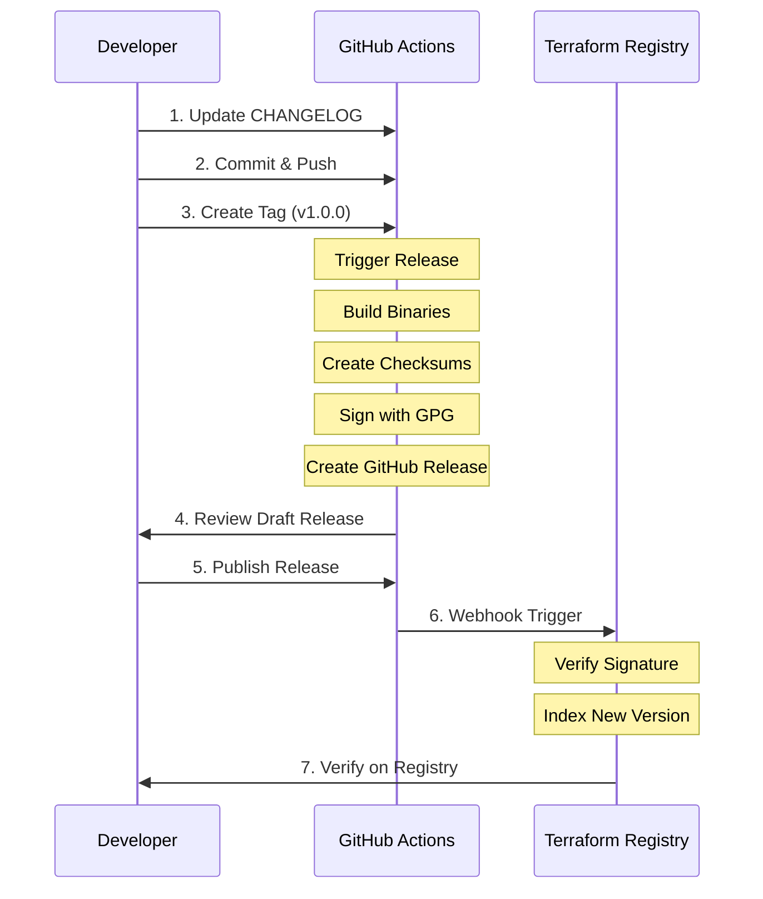

# GitHub Actions CI/CD Setup Summary

This document provides an overview of the GitHub Actions workflows configured for the Terraform Spantree Utils Provider.

## 📁 Files Created

### Workflow Files

- `.github/workflows/test.yml` - Automated testing on PRs and pushes
- `.github/workflows/release.yml` - Automated releases when version tags are pushed

### Configuration Files

- `.goreleaser.yml` - GoReleaser configuration for building cross-platform binaries
- `terraform-registry-manifest.json` - Terraform Registry metadata

### Documentation

- `RELEASE.md` - Comprehensive release process documentation
- `SETUP_RELEASE.md` - Quick setup checklist
- `GITHUB_ACTIONS_SETUP.md` - This file

## 🔄 Workflow Overview

### Test Workflow (`.github/workflows/test.yml`)

**Triggers:**

- Pull requests (except changes to docs/README/LICENSE)
- Pushes to `main` branch

**Jobs:**

1. **Build** (5 min timeout)
   - Checkout code
   - Setup Go from `go.mod`
   - Download dependencies
   - Build the provider
   - Run golangci-lint

2. **Generate**
   - Verify generated code is up to date
   - Ensures `go generate` was run

3. **Unit Tests** (15 min timeout)
   - Run all unit tests with coverage
   - Parallel execution (4 workers)
   - No Terraform acceptance tests

4. **Acceptance Tests** (15 min timeout)
   - Matrix testing across Terraform versions:
     - 1.0.x through 1.9.x
   - Full acceptance test suite (`TF_ACC=1`)
   - Tests provider against real Terraform CLI

**Benefits:**

- Catches bugs before merge
- Ensures compatibility with multiple Terraform versions
- Validates code quality with linting
- Fast feedback (parallel execution)

### Release Workflow (`.github/workflows/release.yml`)

**Triggers:**

- Push of version tags matching `v*` (e.g., `v1.0.0`, `v1.2.3-beta`)

**Jobs:**

1. **GoReleaser**
   - Checkout with full history
   - Setup Go from `go.mod`
   - Import GPG key from secrets
   - Run GoReleaser to:
     - Build binaries for multiple platforms
     - Create checksums
     - Sign with GPG
     - Create GitHub release
     - Upload all artifacts

**Platforms Built:**

- Linux: amd64, 386, arm, arm64
- macOS (Darwin): amd64, arm64
- Windows: amd64, 386, arm, arm64
- FreeBSD: amd64, 386, arm, arm64

**Artifacts Created:**

- Binary archives (`.zip`) for each platform
- `terraform-provider-spantree_X.Y.Z_SHA256SUMS` - Checksums
- `terraform-provider-spantree_X.Y.Z_SHA256SUMS.sig` - GPG signature
- `terraform-provider-spantree_X.Y.Z_manifest.json` - Registry metadata

**Security:**

- GPG signing ensures authenticity
- Checksums verify integrity
- Secrets stored in GitHub (never in code)

## 🔐 Required Secrets

Configure these in GitHub Settings → Secrets and variables → Actions:

| Secret Name | Description | How to Get |
|-------------|-------------|------------|
| `GPG_PRIVATE_KEY` | Your GPG private key (ASCII armored) | `gpg --armor --export-secret-keys FINGERPRINT` |
| `GPG_PASSPHRASE` | Passphrase for your GPG key | The password you set when creating the key |

**Note:** `GITHUB_TOKEN` is automatically provided by GitHub Actions.

## 🚀 Release Process Flow



## 📋 Quick Release Checklist

- [ ] All tests passing on `main` branch
- [ ] `CHANGELOG.md` updated with version and changes
- [ ] Changes committed and pushed
- [ ] Version tag created: `git tag -a v1.0.0 -m "Release v1.0.0"`
- [ ] Tag pushed: `git push origin v1.0.0`
- [ ] GitHub Actions workflow completed successfully
- [ ] Draft release reviewed on GitHub
- [ ] Release published
- [ ] New version appears on Terraform Registry (wait 1-2 min)
- [ ] Test installation: `terraform init` with new version

## 🧪 Testing Locally

Before pushing a tag, you can test the build locally:

```bash
# Install goreleaser
brew install goreleaser

# Test build (creates binaries in dist/ without releasing)
goreleaser build --snapshot --clean

# Check the output
ls -la dist/

# Test a specific binary
./dist/terraform-provider-spantree_darwin_amd64_v1/terraform-provider-spantree_v0.0.0-next
```

## 🔍 Monitoring and Debugging

### View Workflow Runs

- Go to: `https://github.com/spantree/terraform-provider-spantree/actions`
- Click on a workflow run to see logs
- Each job shows detailed output

### Common Issues

**Test Workflow Fails:**

- Check the specific job that failed (build/generate/test)
- Review the error logs
- Fix the issue and push again

**Release Workflow Fails:**

- Most common: GPG key issues
  - Verify secrets are set correctly
  - Check key hasn't expired
- Build failures: Check `.goreleaser.yml` syntax
- Re-run the workflow after fixing

**Release Not on Registry:**

- Ensure release is published (not draft)
- Check webhook deliveries in GitHub Settings
- Verify GPG public key is in Terraform Registry
- Wait 2-3 minutes for processing

## 📊 Workflow Status Badges

Add these to your README.md to show build status:

```markdown
[](https://github.com/spantree/terraform-provider-spantree/actions/workflows/test.yml)
[](https://github.com/spantree/terraform-provider-spantree/actions/workflows/release.yml)
```

## 🔒 Security Best Practices

1. **Secrets Management**
   - Never commit secrets to the repository
   - Rotate GPG keys periodically
   - Use strong passphrases

2. **Code Review**
   - All PRs trigger test workflow
   - Review changes before merging
   - Ensure tests pass before releasing

3. **Release Review**
   - Always review draft releases before publishing
   - Verify all artifacts are present
   - Check release notes are accurate

4. **Access Control**
   - Limit who can push tags
   - Enable branch protection on `main`
   - Require PR reviews

## 📚 Additional Resources

- [GitHub Actions Documentation](https://docs.github.com/en/actions)
- [GoReleaser Documentation](https://goreleaser.com/)
- [Terraform Provider Publishing](https://developer.hashicorp.com/terraform/registry/providers/publishing)
- [GPG Signing Guide](https://docs.github.com/en/authentication/managing-commit-signature-verification)

## 🎯 Next Steps

1. **Complete One-Time Setup** (see [SETUP_RELEASE.md](SETUP_RELEASE.md))
   - Generate GPG key
   - Add secrets to GitHub
   - Register on Terraform Registry
   - Add public key to registry

2. **Test the Workflows**
   - Create a test PR to verify test workflow
   - Create a test tag to verify release workflow
   - Delete test artifacts after verification

3. **Make Your First Release**
   - Follow the steps in [RELEASE.md](RELEASE.md)
   - Start with v1.0.0 or v0.1.0
   - Announce the release

## 💡 Tips

- **Semantic Versioning**: Use MAJOR.MINOR.PATCH format
- **Pre-releases**: Tag with `-beta`, `-alpha`, `-rc` for testing
- **Changelog**: Keep it updated for every release
- **Testing**: Run `make test` and `make testacc` before releasing
- **Documentation**: Update examples and README with new features

## 🤝 Contributing

When contributing:

1. Fork the repository
2. Create a feature branch
3. Make changes with tests
4. Push and create a PR
5. Test workflow runs automatically
6. Address any failures
7. Get review and merge

Releases are handled by maintainers only.

---

**Setup Complete!** 🎉

Your Terraform provider now has:

- ✅ Automated testing on every PR
- ✅ Multi-version Terraform compatibility testing
- ✅ Automated releases with GPG signing
- ✅ Cross-platform binary builds
- ✅ Terraform Registry integration

For questions or issues, see [RELEASE.md](RELEASE.md) or open an issue.
